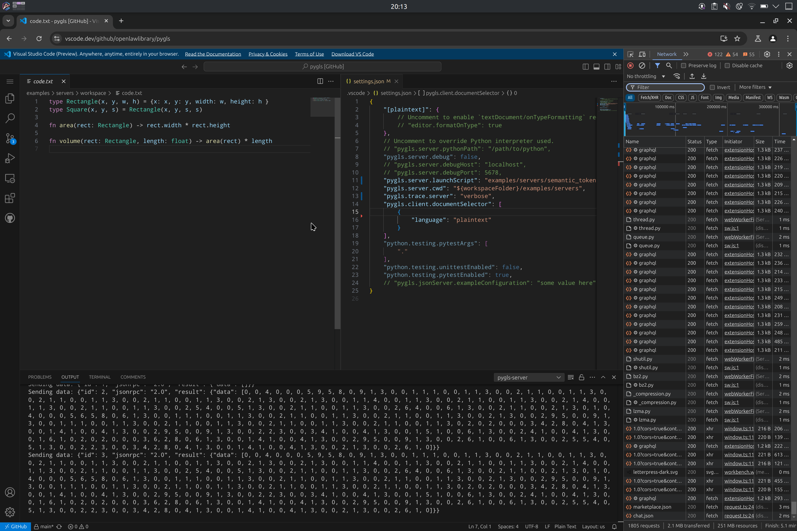

# vscode-wasi-pygls

  </img>

**This is only a tech demo, it make break at any moment.**

## Acknowledgements

This stands on the shoulders of a lot of excellent projects and resources, without which this would be impossible.

**Projects**

- [openlawlibrary/pygls](https://github.com/openlawlibrary/pygls): For making it possible to write language servers in Python
  - **Important Note:** This repo is currently using a random branch of a random fork of the main repo!! See [openlawlibrary/pygls#418](https://github.com/openlawlibrary/pygls/pull/418) for details.
- [brettcannon/cpython-wasi-build](https://github.com/brettcannon/cpython-wasi-build): For providing the WASI build of CPython
- [microsoft/vscode-wasm](https://github.com/microsoft/vscode-wasm): For implementing the WASI host in VSCode as well as the following code snippets, showing how to connect everything up
  - [vscode-wasm/testbeds/python/extension.ts](https://github.com/microsoft/vscode-wasm/blob/65669200000306d174ce2bbfdd9e4d41e9517466/testbeds/python/extension.ts#L17-L38)
  - [vscode-wasm/testbeds/lsp-rust/client/src/extension.ts](https://github.com/microsoft/vscode-wasm/blob/65669200000306d174ce2bbfdd9e4d41e9517466/testbeds/lsp-rust/client/src/extension.ts#L18-L48)
  - [vscode-wasm/testbeds/lsp-rust/client/src/lspServer.ts](https://github.com/microsoft/vscode-wasm/blob/65669200000306d174ce2bbfdd9e4d41e9517466/testbeds/lsp-rust/client/src/lspServer.ts)

**Resources**

- [Testing a Python project using the WASI build of CPython with pytest](https://snarky.ca/testing-a-project-using-the-wasi-build-of-cpython-with-pytest/): For showing how to build and use a Python environment with the WASI build of CPython
- [VSCode and WebAssemblies](https://code.visualstudio.com/blogs/2023/06/05/vscode-wasm-wasi)
